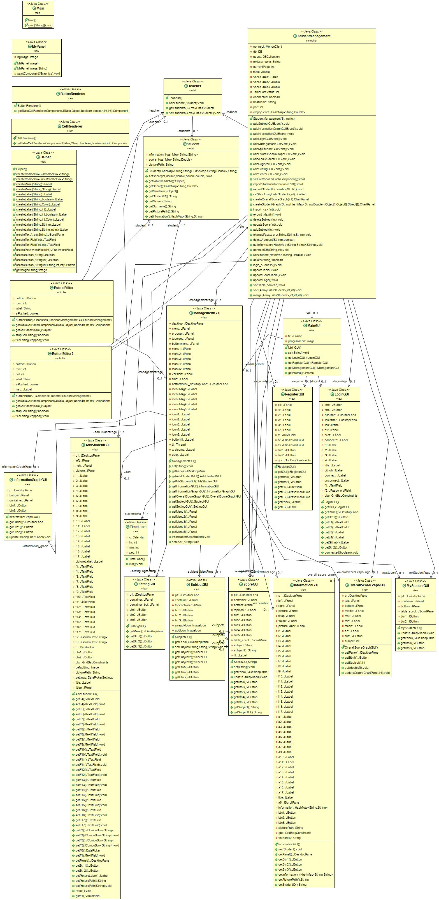

# Student Management
* โปรแกรมจัดการนักเรียนในด้านต่างๆ เช่น ข้อมูลส่วนตัว เกรด คะแนนเก็บ ข้อมูลติดต่อ เป็นต้น
* เป็นส่วนหนึ่งของวิชา OOP KMITL 2019

# Request ⚙️
* Java
* MongoDB

# Group Members :family:
 ||||||
 |:---:|:---:|:---:|:---:|:--:|
|[peetck](https://github.com/peetck)|[thangmo29](https://github.com/thangmo29)|[skaferun9](https://github.com/skaferun9)|[blackjokerr](https://github.com/blackjokerrr)|[nnotex99](https://github.com/nnotex99)|

